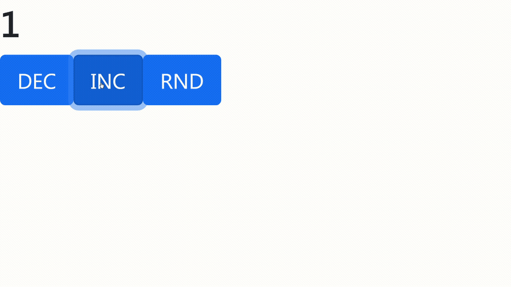

# Dec Inc Rnd 
> Clicker, made with React-Redux
> 
<a href="https://username1111111111.github.io/Dec-Inc-Rnd/">Live demo here</a>

> 
Or 👇:

## Table of Contents
* [General Info](#general-information)
* [Technologies Used](#technologies-used)
* [Features](#features)
* [Screenshots](#screenshots)
* [Setup](#setup)
* [Usage](#usage)
* [Contact](#contact)

## General Information
- This was done as one of my Udemy learning projects
- It was inteded for practice with React and Redux.

## Technologies Used
- React
- Redux
- Bootstrap
- node-sass
- styled-components
- gh-pages (to deploy at github)

## Features
- Increses number by 1
- Decreases number by 1
- Adds random value to number 

## Screenshots

## Setup
1. Clone the repo  
2. Type in terminal `npm install` inside cloned repo

**To build:**
* `npm build`

## Usage
- Type in terminal `npm start` inside cloned repo
- Enjoy 👍

## Contact

<a style="text-decoration: none;"href="https://github.com/Username1111111111/Username1111111111">@Username1111111111</a>
 
  
The Frontend developer

  💪

